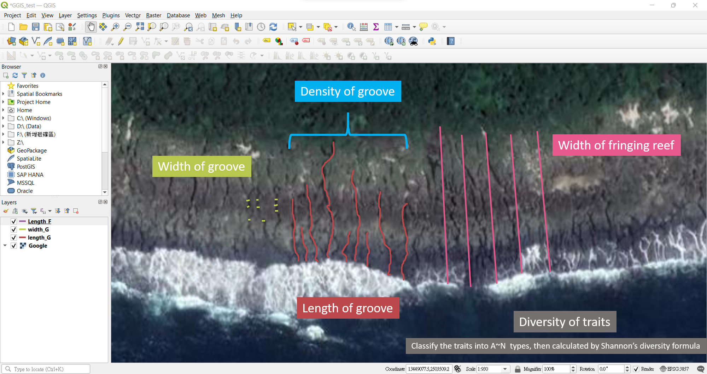

```{r setup, include=FALSE}
knitr::opts_chunk$set(echo = TRUE)
```

## Research questions

1. How is the **morphology of fringing reefs** distributed geographically? What are the differences along the latitude and longitude?

2. Could we estimate the **environmental conditions**, such as SST and wave energy, by the morphology of fringing reefs?

3. Is the morphology of fringing reefs correlated with the **biodiversity**?

4. What is the **relation** between morphology of fringing reefs, environmental conditions and biodiversity?

## Rationale for that question

Fringing reefs are widely distributed in the tropical and subtropical zones across the world. The structure of fringing reefs provide the habitats for the intertidal and subtidal organisms (*Menard et al. 2012* [^1]). Meanwhile, the morphology of fringing reefs are shaped by the reef-building organisms and the environment factors (*Duce et al. 2016* [^2]). Previous researches have studied the growth and morphology of fringing reefs from geology aspect (*Kennedy and Woodroffe 2002* [^3]) and the bathymetric distribution of corals on the fringing reefs (*Dai 1993* [^4]). But the connection between biodiversity and morphology of fringing reefs and their geographical differences has not been studied.    

Fringing reefs can be easily observed from the satellite images in Google Earth. The differences of fringing reefs can be observed along the latitude (*Fig 1.*) or the different side of island. In this project, we would quantify several morphological traits of fringing reefs and try to explore their connection with environmental factors and biology. The spurs and grooves are the most distinct features in the fringing reefs. Therefore, our measurement would base on the morphological traits of the grooves. The assumptions are shown in *Table 1*.


 ---


##### Fig 1. The latitudial differences of fringing reefs in Taiwan.

 ---

##### Table 1. Morphological traits of fringing reefs and their environmental or biological meanings.

|Morphological traits     | Environmental or Biological meanings | 
|:---                     | :---    |
|Width of groove          | narrow groove provide better shelter to avoid predators and physical disturbance    |
|Length of groove         | longer groove means better connectivity between intertidal and subtidal zone   | 
|Density of groove        | higher density means  more space can be utilized by organisms  |
|Width of fringing reef   | larger width means the reef building process is better, which also means warmer SST and less wave energy  |
|Diversity of traits      | higher diversity means more ecological niches can be utilized  by different species  | 

 ---


## Data sources

Taiwan would be an ideal preliminary study site for this project. Because there are well-developed fringing reefs and sufficient biological and environmental data can be accessed. The date of satellite images do not need to match with environmental and biological data because the structure of fringing reefs is relatively unchanged. But long-term biological and environmental data is needed to know the average condition in our study sites.

1. Satellite images: 
  - Google Earth
  - Planet Explorer

2. Environmental data: 
  - [Earth Engine Data Catalog](https://developers.google.com/earth-engine/datasets/catalog) 
  - [Central Weather Bureau, Taiwan Government](https://www.cwb.gov.tw/V8/C/)
  - [Ocean Data Bank, National Science and Technology Council, Taiwan](https://www.odb.ntu.edu.tw/)

3. Biological data:
  - [IOCEAN, Ocean Affairs Council, Taiwan Government](https://iocean.oca.gov.tw/iOceanMap/map.aspx)
  - Local references or monitoring projects


## Proposed methods for data extraction and analysis

- Morphological traits of fringing reefs and their geographical location can be extracted directly by Google Earth or using **QGIS** by importing the satellite images. They can be calculated by creating line features. The measurement of each morphological traits is shown in *Fig 2*. While the proportion of each trait (type A~N) is: $$p_{i}$$. The equation of trait diversity is: $$TraitDiversity = -\sum_{i=A}^{N} p_{i}*ln p_{i} $$ 

- For quantifying the morphological differences, the **resolution of satellite images are needed to be greater than 3 m/pix**.

- Some morphological traits (such as density of groove) might be measured more efficiently by applying the **machine learning**. 

- By adjusting the **bands in the satellite images**. Morphological features might be extracted more easily.



##### Fig 2. The measurement of morpohlogical traits in QGIS.


## Limitation

- Except morphology of fringing reefs and environmental conditions, there are other factors that would also affect biodiversity, such as human disturbation or natural history. 

- The in-situ and Long-term biological data are needed for better evaluation.

- The correlation between underwater and above water structure of fringing reefs needs further assessment. 

- The structure of fringing reefs can be complicated and have variable components. For example, some fringing reefs have lagoon, high proportion of sandy substrate or extended reef flat. Our measurement of the morphological traits might not evaluate their differences.


## Significant of project

- know more about how might structure of habitats maintain the biodiversity.
- figure out the distribution and the pattern of the morphological traits of fringing reefs can benefit the marine resources and coastal management. 
- provide more quantified data for the other biological models.
- provide a new assessment for evaluating the condition of habitats.

## Reference

[^4]: [Dai, C. F. (1993). Patterns of coral distribution and benthic space partitioning on the fringing reefs of southern Taiwan. Marine Ecology, 14(3), 185-204.](https://doi.org/10.1111/j.1439-0485.1993.tb00479.x)

[^2]: [Duce, S., Vila-Concejo, A., Hamylton, S. M., Webster, J. M., Bruce, E., & Beaman, R. J. (2016). A morphometric assessment and classification of coral reef spur and groove morphology. Geomorphology, 265, 68-83.](https://doi.org/10.1016/j.geomorph.2016.04.018)

[^3]: [Kennedy, D. M., & Woodroffe, C. D. (2002). Fringing reef growth and morphology: a review. Earth-Science Reviews, 57(3-4), 255-277.](https://doi.org/10.1016/S0012-8252(01)00077-0)

[^1]: [Menard, A., Turgeon, K., Roche, D. G., Binning, S. A., & Kramer, D. L. (2012). Shelters and their use by fishes on fringing coral reefs. PloS one, 7(6), e38450.](https://doi.org/10.1371/journal.pone.0038450)
